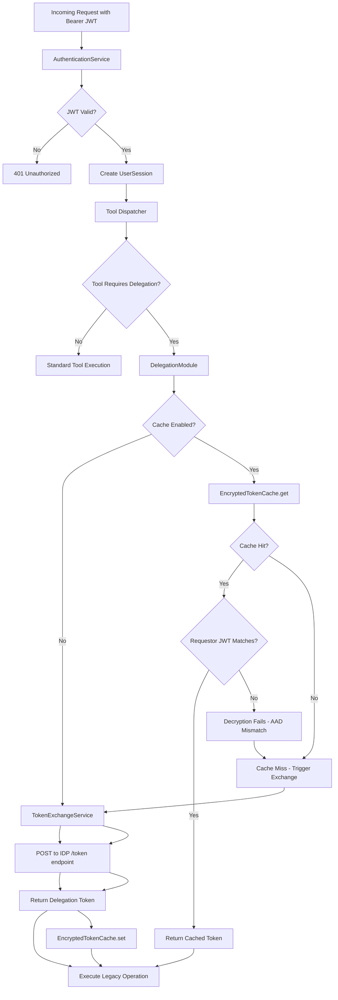

# Unified OAuth & Token Exchange Implementation Plan (v3)

**Version:** 3.0
**Date:** 2025-01-08
**Status:** Design Approved

---

## Goal

To implement a secure, architecturally-sound token exchange mechanism for legacy delegation that:

1. **Preserves stateless architecture** - Primary authentication flow remains stateless
2. **Respects architectural layering** - Core layer has no network I/O dependencies
3. **Provides optional performance optimization** - Encrypted token cache as opt-in feature
4. **Eliminates security vulnerabilities** - Cryptographic binding prevents impersonation attacks
5. **Supports graceful degradation** - Automatic cache invalidation on requestor JWT changes

---

## Guiding Principles

This design is guided by the following non-negotiable principles:

### 1. Preserve Stateless Architecture
The primary authentication flow will remain **strictly stateless**. Token caching is an **optional performance enhancement**, disabled by default, that does not compromise the stateless authentication model.

### 2. Enforce Architectural Layering
The Core layer will not perform network I/O. Any component requiring HTTP clients (TokenExchangeService, EncryptedTokenCache) will reside in the Delegation layer.

### 3. Prioritize Security & Simplicity
We favour simpler, more secure designs over complex mechanisms. The latency of token exchange is an acceptable trade-off for security on delegation calls.

### 4. Exchange On-Demand, Not Pre-emptively
Token exchange is a specialized action performed only by delegation modules when they need to impersonate a user. It is not part of the primary authentication flow.

### 5. Cryptographic Binding Over Manual Validation
Security properties are enforced cryptographically (via AAD in AES-GCM) rather than through manual validation checks, reducing implementation complexity and eliminating edge cases.

---

## Authorization Model

### Two-Stage Authorization Pattern

This architecture implements a **dual-authorization model** with clear separation between MCP-level access control and downstream resource access control:

| Stage | Authorization Source | Purpose | Controls |
|-------|---------------------|---------|----------|
| **Stage 1: MCP Tool Access** | **Requestor JWT** | Determines which MCP tools are visible/callable | Tool visibility in `tools/list`, initial `canAccess()` checks |
| **Stage 2: Downstream Resource Access** | **TE-JWT (Delegation Token)** | Defines permissions within the downstream resource | API permissions, user account mapping, resource-level authorization |

### Downstream Resource Types

The TE-JWT delegation pattern supports multiple downstream resource types:

| Resource Type | Use Case | TE-JWT Usage | Example |
|---------------|----------|--------------|---------|
| **Legacy SQL Server** | On-behalf-of database access | `EXECUTE AS USER = @legacyUsername` | Enterprise data warehouse queries |
| **Modern REST API** | Machine-to-machine API calls | Bearer token in `Authorization` header | Salesforce API, GitHub API, internal microservices |
| **GraphQL API** | Scoped data access | Bearer token + field-level permissions | Customer data API, analytics platform |
| **Kerberos Services** | Windows/Active Directory integration | Constrained delegation (S4U2Proxy) | File shares, Exchange servers |
| **Cloud Resources** | AWS/Azure/GCP resources | Service-scoped credentials | S3 buckets, Azure Blob, BigQuery |
| **Internal Microservices** | Service mesh authorization | mTLS + JWT bearer token | Payment service, notification service |

### Flow Examples

#### Example 1: Legacy SQL Server Access

```
┌─────────────────────────────────────────────────────────┐
│ 1. User Authentication                                  │
│    Requestor JWT: { roles: ["user"],                   │
│                     permissions: ["sql:query"],         │
│                     legacy_name: "ALICE_ADMIN" }       │
└────────────────────┬────────────────────────────────────┘
                     │
                     ▼
┌─────────────────────────────────────────────────────────┐
│ 2. MCP Tool Discovery (tools/list)                      │
│    Authorization: Requestor JWT                         │
│    Result: User sees "sql-delegate" tool               │
│            (because requestor has "sql:query" perm)     │
└────────────────────┬────────────────────────────────────┘
                     │
                     ▼
┌─────────────────────────────────────────────────────────┐
│ 3. User Calls Tool (tools/call)                         │
│    Initial Check: Requestor JWT (has "sql:query"?)      │
│    → Passed, proceed to delegation                      │
└────────────────────┬────────────────────────────────────┘
                     │
                     ▼
┌─────────────────────────────────────────────────────────┐
│ 4. Token Exchange                                        │
│    Subject Token: Requestor JWT                         │
│    Audience: "urn:sql:database"                         │
│    IDP returns TE-JWT:                                   │
│      { roles: ["admin"],                                │
│        permissions: ["db:admin", "db:read", "db:write"],│
│        legacy_name: "ALICE_ADMIN",                      │
│        aud: "urn:sql:database" }                        │
└────────────────────┬────────────────────────────────────┘
                     │
                     ▼
┌─────────────────────────────────────────────────────────┐
│ 5. Downstream Resource Access (SQL Server)              │
│    Authorization: TE-JWT roles/permissions              │
│    Account Mapping: TE-JWT.legacy_name = "ALICE_ADMIN"  │
│    SQL Execution: EXECUTE AS USER = 'ALICE_ADMIN'       │
│    Permissions: TE-JWT "admin" role → full DB access    │
└─────────────────────────────────────────────────────────┘
```

#### Example 2: Modern REST API Access

```
┌─────────────────────────────────────────────────────────┐
│ 1. User Authentication                                  │
│    Requestor JWT: { roles: ["user"],                   │
│                     permissions: ["api:call"],          │
│                     sub: "alice@company.com" }          │
└────────────────────┬────────────────────────────────────┘
                     │
                     ▼
┌─────────────────────────────────────────────────────────┐
│ 2. MCP Tool Discovery (tools/list)                      │
│    Authorization: Requestor JWT                         │
│    Result: User sees "salesforce-api" tool              │
│            (because requestor has "api:call" perm)      │
└────────────────────┬────────────────────────────────────┘
                     │
                     ▼
┌─────────────────────────────────────────────────────────┐
│ 3. User Calls Tool (tools/call)                         │
│    Tool: "salesforce-api"                               │
│    Action: "query_accounts"                             │
└────────────────────┬────────────────────────────────────┘
                     │
                     ▼
┌─────────────────────────────────────────────────────────┐
│ 4. Token Exchange                                        │
│    Subject Token: Requestor JWT                         │
│    Audience: "https://api.salesforce.com"               │
│    Scope: "api user_data"                               │
│    IDP returns TE-JWT:                                   │
│      { sub: "alice@company.com",                        │
│        scope: "api user_data",                          │
│        aud: "https://api.salesforce.com",               │
│        permissions: ["read:accounts", "write:contacts"] }│
└────────────────────┬────────────────────────────────────┘
                     │
                     ▼
┌─────────────────────────────────────────────────────────┐
│ 5. Downstream Resource Access (Salesforce API)          │
│    HTTP Request:                                         │
│      GET https://api.salesforce.com/v2/accounts         │
│      Authorization: Bearer <TE-JWT>                      │
│    Salesforce validates:                                 │
│      - TE-JWT signature and expiry                       │
│      - aud claim = "https://api.salesforce.com"         │
│      - scope includes "api"                              │
│      - permissions include "read:accounts"               │
│    → Returns account data to MCP tool                    │
└─────────────────────────────────────────────────────────┘
```

#### Example 3: Machine-to-Machine Service Call

```
┌─────────────────────────────────────────────────────────┐
│ 1. User Authentication                                  │
│    Requestor JWT: { roles: ["user"],                   │
│                     permissions: ["payment:process"],   │
│                     sub: "alice@company.com" }          │
└────────────────────┬────────────────────────────────────┘
                     │
                     ▼
┌─────────────────────────────────────────────────────────┐
│ 2. MCP Tool Discovery                                   │
│    Result: User sees "process-payment" tool             │
└────────────────────┬────────────────────────────────────┘
                     │
                     ▼
┌─────────────────────────────────────────────────────────┐
│ 3. Token Exchange                                        │
│    Audience: "urn:payment-service"                      │
│    IDP returns TE-JWT:                                   │
│      { sub: "mcp-server",  ← Machine identity!          │
│        azp: "mcp-oauth",                                │
│        act: { sub: "alice@company.com" },  ← User ctx   │
│        scope: "payment:create payment:read",            │
│        aud: "urn:payment-service" }                     │
└────────────────────┬────────────────────────────────────┘
                     │
                     ▼
┌─────────────────────────────────────────────────────────┐
│ 4. Downstream Service Access (Payment API)              │
│    HTTP Request:                                         │
│      POST https://payment.svc/api/v1/charges            │
│      Authorization: Bearer <TE-JWT>                      │
│    Payment service validates:                            │
│      - TE-JWT.sub = "mcp-server" (machine identity)     │
│      - TE-JWT.act.sub = "alice@company.com" (user ctx)  │
│      - TE-JWT.azp = "mcp-oauth" (authorized party)      │
│      - scope includes "payment:create"                   │
│    → Processes payment on behalf of Alice                │
└─────────────────────────────────────────────────────────┘
```

### Key Design Principles

**Separation of Concerns:**
- **Requestor JWT** answers: "Can this user call this MCP tool?"
- **TE-JWT** answers: "What can this user do in the downstream resource?"

**Why This Matters:**

1. **Different Permission Scopes:**
   - Requestor JWT may grant broad MCP access (`api:call` permission)
   - TE-JWT may grant fine-grained resource permissions (`read:accounts`, `admin` role)
   - These are intentionally decoupled

2. **IDP Control:**
   - IDP can issue TE-JWT with different roles/scopes than requestor JWT
   - Allows privilege elevation or reduction based on target resource
   - Example: User has "user" role in MCP, but "admin" scope for Salesforce API

3. **Identity Mapping:**
   - **On-behalf-of pattern:** `TE-JWT.sub` = user identity (e.g., `alice@company.com`)
   - **Machine-to-machine pattern:** `TE-JWT.sub` = service identity, `TE-JWT.act.sub` = user context
   - **Legacy systems:** `TE-JWT.legacy_name` defines account to impersonate
   - Example: `alice@company.com` → `ALICE_ADMIN` in SQL Server

### Authorization Validation Points

```typescript
// Point 1: MCP Tool Visibility (tools/list)
// Uses: Requestor JWT
function getAvailableTools(session: UserSession): Tool[] {
  return allTools.filter(tool => {
    // Check requestor JWT roles/permissions
    return tool.canAccess(session); // Uses session.roles, session.permissions
  });
}

// Point 2: MCP Tool Invocation (tools/call)
// Uses: Requestor JWT
async function invokeTool(toolName: string, params: any, session: UserSession) {
  const tool = findTool(toolName);

  // Re-validate requestor JWT authorization
  if (!tool.canAccess(session)) {
    throw new Error("Unauthorized");
  }

  // Execute tool handler
  return await tool.handler(params, { session });
}

// Point 3: Downstream Resource Access (delegation)
// Uses: TE-JWT
async function delegate(session: UserSession, action: string, params: any) {
  // Perform token exchange (requestor JWT → TE-JWT)
  const delegationToken = await tokenExchange.exchange({
    requestorJWT: session.claims.rawPayload,
    audience: 'urn:api:salesforce',  // Target resource audience
    scope: 'api user_data'
  });

  // Decode TE-JWT for downstream authorization
  const delegationClaims = decodeJWT(delegationToken);

  // CRITICAL: Use TE-JWT roles/permissions/scopes for downstream resource
  const resourceScopes = delegationClaims.scope?.split(' ') || [];
  const resourcePermissions = delegationClaims.permissions || [];

  // Call downstream resource with TE-JWT as Bearer token
  const response = await fetch('https://api.salesforce.com/v2/accounts', {
    headers: {
      'Authorization': `Bearer ${delegationToken}`,  // ← TE-JWT
      'Content-Type': 'application/json'
    }
  });

  return await response.json();
}
```

### Security Implications

**Privilege Scoping is Controlled by IDP:**

The IDP can issue TE-JWTs with different scopes/permissions than the requestor JWT, enabling:
- **Privilege elevation** for trusted downstream resources
- **Privilege reduction** for untrusted third-party APIs
- **Scope narrowing** for least-privilege access

#### Example 1: Privilege Elevation (Legacy SQL)

```json
// Requestor JWT (MCP)
{
  "roles": ["user"],
  "permissions": ["sql:query"],  // Limited MCP access
  "sub": "alice@company.com"
}

// TE-JWT (SQL Server)
{
  "roles": ["admin"],            // Elevated downstream access
  "permissions": ["db:admin"],
  "legacy_name": "ALICE_ADMIN",
  "aud": "urn:sql:database"
}
```

**Result:**
- ✅ User can call `sql-delegate` tool (requestor JWT grants `sql:query`)
- ✅ User has admin rights in SQL Server (TE-JWT grants `admin` role)
- ✅ Controlled by IDP policy (IDP decides to issue admin TE-JWT)
- ✅ Auditable (token exchange logged with both JWTs)

#### Example 2: Privilege Reduction (Third-Party API)

```json
// Requestor JWT (MCP)
{
  "roles": ["admin"],
  "permissions": ["api:call", "admin:manage"],  // Full MCP access
  "sub": "alice@company.com"
}

// TE-JWT (External Analytics API)
{
  "scope": "read:reports",       // Reduced downstream access (read-only!)
  "permissions": ["read:reports"],
  "aud": "https://analytics.external.com"
}
```

**Result:**
- ✅ User can call `analytics-api` tool (requestor JWT grants `api:call`)
- ✅ User has read-only access to external API (TE-JWT grants only `read:reports`)
- ✅ Even though user is admin in MCP, external API sees limited scope
- ✅ Prevents over-privileged third-party API access

#### Example 3: Machine-to-Machine (Service Identity)

```json
// Requestor JWT (MCP)
{
  "sub": "alice@company.com",
  "permissions": ["payment:process"]
}

// TE-JWT (Payment Service)
{
  "sub": "mcp-server",           // Machine identity (not Alice!)
  "azp": "mcp-oauth",
  "act": {                       // Acting on behalf of Alice
    "sub": "alice@company.com"
  },
  "scope": "payment:create",
  "aud": "urn:payment-service"
}
```

**Result:**
- ✅ Payment service sees machine identity (`sub: "mcp-server"`)
- ✅ Payment service knows acting user (`act.sub: "alice@company.com"`)
- ✅ Enables proper service-to-service authentication
- ✅ Audit trail shows both machine and user context

**This is SECURE because:**
1. User must have valid requestor JWT to reach MCP
2. IDP validates user identity before issuing TE-JWT
3. IDP enforces policy on what scopes/permissions to grant in TE-JWT
4. Downstream resource enforces its own authorization based on TE-JWT
5. All token exchanges are audited
6. TE-JWT can have different (elevated or reduced) permissions than requestor JWT

### Summary: Who Controls What?

| Question | Answer | Token Used |
|----------|--------|------------|
| **Can user see this tool in tools/list?** | Requestor JWT roles/permissions | Requestor JWT |
| **Can user call this tool?** | Requestor JWT roles/permissions | Requestor JWT |
| **Which identity for downstream resource?** | TE-JWT `sub` claim (user or machine) | TE-JWT |
| **Which account for legacy systems?** | TE-JWT `legacy_name` claim | TE-JWT |
| **What permissions in downstream resource?** | TE-JWT `scope`, `roles`, `permissions` claims | TE-JWT |
| **Can user execute this API operation?** | TE-JWT scopes/permissions validated by resource | TE-JWT |
| **What is logged in audit trail?** | Both requestor JWT and TE-JWT | Both |

**Key Takeaway:** Requestor JWT gets you TO the tool, TE-JWT defines what you can DO in the downstream resource.

---

## Architecture Overview

### Layered Architecture Diagram

```
┌─────────────────────────────────────────────────────────────┐
│                     Core Layer                               │
│              (Stateless, No Network I/O)                     │
│                                                              │
│  ┌──────────────────────────────────────────────────────┐  │
│  │   AuthenticationService                               │  │
│  │   - Validates incoming Bearer JWT                     │  │
│  │   - Creates UserSession from JWT claims               │  │
│  │   - No knowledge of token exchange                    │  │
│  └──────────────────────────────────────────────────────┘  │
└────────────────────────┬─────────────────────────────────────┘
                         │
                         ▼
┌─────────────────────────────────────────────────────────────┐
│                  Application Layer                           │
│                                                              │
│  ┌──────────────────────────────────────────────────────┐  │
│  │   Tool Dispatcher                                     │  │
│  │   - Routes requests to appropriate tools              │  │
│  │   - Determines if delegation required                 │  │
│  └──────────────────────────────────────────────────────┘  │
└────────────────────────┬─────────────────────────────────────┘
                         │
                         ▼
┌─────────────────────────────────────────────────────────────┐
│                 Delegation Layer                             │
│              (Network I/O Allowed)                           │
│                                                              │
│  ┌──────────────────────────────────────────────────────┐  │
│  │   DelegationModule (e.g., SQLDelegationModule)       │  │
│  │   - Initiates token exchange when needed             │  │
│  │   - Passes requestor JWT to TokenExchangeService     │  │
│  │   - Uses delegation token for legacy operation       │  │
│  └────────────┬─────────────────────────────────────────┘  │
│               │                                              │
│               ▼                                              │
│  ┌──────────────────────────────────────────────────────┐  │
│  │   TokenExchangeService                                │  │
│  │   - POST to IDP /token endpoint                       │  │
│  │   - Returns delegation token                          │  │
│  │   - Optional: Uses EncryptedTokenCache                │  │
│  └────────────┬─────────────────────────────────────────┘  │
│               │                                              │
│               ▼                                              │
│  ┌──────────────────────────────────────────────────────┐  │
│  │   EncryptedTokenCache (OPTIONAL)                      │  │
│  │   - AES-256-GCM encryption                            │  │
│  │   - Requestor JWT hash as AAD                         │  │
│  │   - Session-specific encryption keys                  │  │
│  │   - Automatic invalidation on JWT change              │  │
│  └──────────────────────────────────────────────────────┘  │
└─────────────────────────────────────────────────────────────┘
```

### Authentication & Delegation Flow



---

## Component Responsibilities

### 1. AuthenticationService (Core Layer)

**Location:** `src/core/authentication.ts`

**Responsibilities:**
- Validates incoming Bearer JWT against trusted IDPs
- Creates UserSession object from requestor JWT claims
- **No knowledge of token exchange** (maintains stateless design)

**Key Methods:**
```typescript
async validateJWT(jwt: string): Promise<UserSession>
```

### 2. DelegationModule (Delegation Layer)

**Location:** `src/delegation/sql/sql-module.ts` (example)

**Responsibilities:**
- Initiates token exchange when delegation required
- Extracts requestor JWT from UserSession
- Calls TokenExchangeService with target audience/scope
- **Decodes TE-JWT to extract legacy authorization**
  - Legacy account name (`legacy_name` claim)
  - Legacy roles (`roles` claim)
  - Legacy permissions (`permissions` claim)
- **Uses TE-JWT authorization for legacy system access**
- Immediately discards delegation token after use

**Key Methods:**
```typescript
async delegate(
  session: UserSession,
  action: string,
  params: any,
  context?: { sessionId?: string }
): Promise<DelegationResult>
```

**Implementation Example:**
```typescript
export class SQLDelegationModule implements DelegationModule {
  async delegate(
    session: UserSession,
    action: string,
    params: any,
    context?: { sessionId?: string }
  ): Promise<DelegationResult> {
    // Extract requestor JWT (for token exchange)
    const requestorJWT = session.claims.rawPayload as string;

    // Perform token exchange
    const delegationToken = await this.tokenExchange.exchange({
      sessionId: context?.sessionId,
      requestorJWT,
      idpConfig: this.idpConfig,
      audience: 'urn:sql:database',
      scope: 'db:execute_as'
    });

    // CRITICAL: Decode TE-JWT for legacy authorization
    const delegationClaims = decodeJWT(delegationToken);

    // Extract TE-JWT authorization (NOT requestor JWT!)
    const legacyUsername = delegationClaims.legacy_name;      // Legacy account
    const legacyRoles = delegationClaims.roles || [];         // Legacy roles
    const legacyPermissions = delegationClaims.permissions || []; // Legacy perms

    // Validate TE-JWT has required claims
    if (!legacyUsername) {
      throw createSecurityError('MISSING_LEGACY_NAME',
        'Delegation token missing legacy_name claim', 400);
    }

    // Use TE-JWT authorization for SQL operation
    const result = await this.executeSQLWithDelegation(
      legacyUsername,
      legacyRoles,
      legacyPermissions,
      action,
      params
    );

    return result;
  }

  private async executeSQLWithDelegation(
    legacyUsername: string,
    legacyRoles: string[],
    legacyPermissions: string[],
    action: string,
    params: any
  ): Promise<any> {
    // Check TE-JWT permissions for this operation
    if (action === 'delete' && !legacyPermissions.includes('db:write')) {
      throw createSecurityError('INSUFFICIENT_PERMISSIONS',
        'Delegation token lacks db:write permission for DELETE', 403);
    }

    // Execute SQL as legacy user
    const sql = `
      EXECUTE AS USER = @legacyUsername;
      ${params.sql};
      REVERT;
    `;

    return await this.sqlClient.query(sql, {
      legacyUsername,
      ...params.params
    });
  }
}
```

### 3. TokenExchangeService (Delegation Layer)

**Location:** `src/delegation/token-exchange.ts`

**Responsibilities:**
- Constructs POST request to IDP /token endpoint
- Implements RFC 8693 Token Exchange protocol
- **Optionally** checks EncryptedTokenCache before exchange
- **Optionally** stores delegation token in cache after exchange
- Performs no caching if cache disabled (default)

**Key Methods:**
```typescript
async exchange(params: {
  sessionId?: string;
  requestorJWT: string;
  idpConfig: IDPConfig;
  audience: string;
  scope: string;
}): Promise<string>
```

**Implementation:**
```typescript
export class TokenExchangeService {
  private cache?: EncryptedTokenCache;

  constructor(cache?: EncryptedTokenCache, auditService?: AuditService) {
    this.cache = cache;
  }

  async exchange(params: TokenExchangeParams): Promise<string> {
    const { sessionId, requestorJWT, idpConfig, audience, scope } = params;

    // Check cache if enabled and sessionId provided
    if (this.cache && sessionId) {
      const cached = await this.cache.get(sessionId, requestorJWT, audience);
      if (cached) {
        return cached; // Cache hit
      }
    }

    // Perform token exchange with IDP
    const delegationToken = await this.performExchange(
      requestorJWT,
      idpConfig,
      audience,
      scope
    );

    // Cache if enabled
    if (this.cache && sessionId) {
      await this.cache.set(sessionId, requestorJWT, audience, delegationToken);
    }

    return delegationToken;
  }

  private async performExchange(
    requestorJWT: string,
    idpConfig: IDPConfig,
    audience: string,
    scope: string
  ): Promise<string> {
    const response = await fetch(idpConfig.tokenExchange.tokenEndpoint, {
      method: 'POST',
      headers: { 'Content-Type': 'application/x-www-form-urlencoded' },
      body: new URLSearchParams({
        grant_type: 'urn:ietf:params:oauth:grant-type:token-exchange',
        client_id: idpConfig.tokenExchange.clientId,
        client_secret: idpConfig.tokenExchange.clientSecret,
        subject_token: requestorJWT,
        subject_token_type: 'urn:ietf:params:oauth:token-type:jwt',
        audience: audience,
        scope: scope
      })
    });

    if (!response.ok) {
      throw new Error(`Token exchange failed: ${response.status}`);
    }

    const data = await response.json();
    return data.access_token;
  }
}
```

### 4. EncryptedTokenCache (Delegation Layer) - OPTIONAL

**Location:** `src/delegation/encrypted-token-cache.ts`

**Responsibilities:**
- Encrypts delegation tokens using AES-256-GCM
- Uses requestor JWT hash as Additional Authenticated Data (AAD)
- Manages session-specific encryption keys
- Automatically invalidates cache on requestor JWT change
- Synchronizes TTL with delegation token exp claim
- Implements heartbeat-based session cleanup

**Key Security Properties:**
- ✅ **Cryptographic Binding** - Requestor hash as AAD prevents impersonation
- ✅ **Automatic Invalidation** - Decryption fails if requestor JWT changes
- ✅ **Perfect Forward Secrecy** - Session keys destroyed on termination
- ✅ **Zero Storage Overhead** - AAD not stored (embedded in authTag)
- ✅ **Replay Resistance** - Cannot reuse cached token with different JWT
- ✅ **Tamper Detection** - GCM authentication tag validates integrity

**Key Methods:**
```typescript
activateSession(sessionId: string, jwtSubject: string): void
async set(sessionId: string, requestorJWT: string, audience: string, delegationToken: string): Promise<void>
async get(sessionId: string, requestorJWT: string, audience: string): Promise<string | null>
async clearSession(sessionId: string): Promise<void>
```

---

## Secure Token Cache Design

### Cryptographic Architecture

The cache uses **AES-256-GCM encryption** with **requestor JWT hash as Additional Authenticated Data (AAD)** to achieve cryptographic binding without storing the requestor hash.

#### Why AAD-Based Binding?

Traditional approach (REJECTED):
```typescript
// Store requestor hash separately
interface CacheEntry {
  encryptedToken: string;
  requestorHash: string;  // ← 64 bytes overhead per entry
  // ...
}

// Manual validation required
if (sha256(requestorJWT) !== cached.requestorHash) {
  throw new Error("Mismatch");
}
```

**AAD-based approach (APPROVED):**
```typescript
// Requestor hash embedded in encryption
interface CacheEntry {
  encryptedToken: string;
  iv: string;
  authTag: string;  // ← Contains AAD binding!
  // No requestorHash field needed ✅
}

// Automatic validation (decryption fails if mismatch)
const requestorHash = sha256(requestorJWT);
const token = decrypt(ciphertext, key, iv, authTag, AAD: requestorHash);
// ↑ Throws automatically if requestor changed
```

### Encryption Process

**Encrypting Delegation Token:**

```typescript
// 1. Hash requestor JWT
const requestorHash = crypto.createHash('sha256')
  .update(requestorJWT)
  .digest('hex');

// 2. Generate random IV
const iv = crypto.randomBytes(12);

// 3. Create cipher with session-specific key
const cipher = crypto.createCipheriv('aes-256-gcm', sessionKey, iv);

// 4. CRITICAL: Set requestor hash as AAD
cipher.setAAD(Buffer.from(requestorHash, 'hex'));

// 5. Encrypt delegation token
const ciphertext = cipher.update(delegationToken, 'utf8', 'base64')
                 + cipher.final('base64');

// 6. Get authentication tag (includes AAD in computation)
const authTag = cipher.getAuthTag();

// 7. Store: { ciphertext, iv, authTag }
// Note: requestorHash NOT stored!
```

**Decrypting Delegation Token:**

```typescript
// 1. Hash current requestor JWT
const requestorHash = crypto.createHash('sha256')
  .update(currentRequestorJWT)
  .digest('hex');

// 2. Create decipher
const decipher = crypto.createDecipheriv('aes-256-gcm', sessionKey, iv);

// 3. CRITICAL: Set same AAD used during encryption
decipher.setAAD(Buffer.from(requestorHash, 'hex'));

// 4. Set authentication tag
decipher.setAuthTag(authTag);

// 5. Decrypt (will THROW if AAD mismatch)
const token = decipher.update(ciphertext, 'base64', 'utf8')
            + decipher.final('utf8');  // ← Fails if requestor JWT changed!
```

### Automatic Invalidation on Requestor JWT Change

**Scenario: User re-authenticates with new JWT**

```
T=0:00  User authenticates with JWT_v1 (exp: T+60min)
        Delegation token cached with AAD = hash(JWT_v1)

T=0:30  User calls tools → cache hits ✅ (JWT_v1 still valid)

T=61:00 JWT_v1 expires, client refreshes to JWT_v2 (new exp)

T=61:01 User calls tool → cache.get(sessionId, JWT_v2, audience)
        → Decryption fails ❌ (AAD = hash(JWT_v2) ≠ hash(JWT_v1))
        → Cache miss → Token exchange with JWT_v2
        → New delegation token cached with AAD = hash(JWT_v2)

T=61:02 Subsequent calls use JWT_v2 → cache hits ✅
```

**Result:** Seamless re-authentication, no user-visible errors, automatic security enforcement.

### TTL Synchronization

Cache expiry is calculated as **minimum** of:
1. Delegation token JWT `exp` claim
2. Configured cache TTL (default: 60 seconds)

```typescript
async set(sessionId: string, requestorJWT: string, audience: string, delegationToken: string) {
  // Extract delegation token expiry
  const tokenExpiry = this.extractExpiry(delegationToken);  // JWT exp claim

  // Calculate cache expiry
  const configExpiry = Date.now() + (this.config.ttlSeconds * 1000);  // 60s default
  const cacheExpiry = Math.min(tokenExpiry, configExpiry);  // Use shorter

  // Encrypt and store
  const encrypted = this.encryptWithBinding(sessionId, delegationToken, requestorHash);
  sessionCache.set(audience, {
    encryptedToken: encrypted.ciphertext,
    iv: encrypted.iv,
    authTag: encrypted.authTag,
    tokenExpiry,
    cacheExpiry,  // ← Never exceeds token lifetime
    createdAt: Date.now()
  });
}
```

### Session-Specific Encryption Keys (Perfect Forward Secrecy)

Each MCP session has a **unique 256-bit encryption key**:

```typescript
activateSession(sessionId: string, jwtSubject: string): void {
  // Generate unique key for this session
  const sessionKey = crypto.randomBytes(32);  // 256-bit random key

  this.sessionKeys.set(sessionId, sessionKey);
  this.sessionOwners.set(sessionId, jwtSubject);
}

async clearSession(sessionId: string): Promise<void> {
  // Destroy encryption key (perfect forward secrecy)
  const key = this.sessionKeys.get(sessionId);
  if (key) {
    key.fill(0);  // Zero out memory
    this.sessionKeys.delete(sessionId);
  }

  // Clear cached tokens
  this.cache.delete(sessionId);
}
```

**Security Property:** If a session key is compromised, it only affects that one session. Key destruction on session termination provides perfect forward secrecy.

---

## Configuration Schema

### Updated trustedIDPs Configuration

```json
{
  "trustedIDPs": [
    {
      "issuer": "http://localhost:8080/realms/mcp_security",
      "jwksUri": "http://localhost:8080/realms/mcp_security/protocol/openid-connect/certs",
      "audience": "mcp-oauth",
      "algorithms": ["RS256"],
      "claimMappings": {
        "legacyUsername": "legacy_name",
        "roles": "roles",
        "scopes": "scope"
      },
      "security": {
        "clockTolerance": 60,
        "maxTokenAge": 3600,
        "requireNbf": false
      },
      "tokenExchange": {
        "tokenEndpoint": "http://localhost:8080/realms/mcp_security/protocol/openid-connect/token",
        "clientId": "mcp-server-client",
        "clientSecret": "YOUR_CLIENT_SECRET",
        "cache": {
          "enabled": false,
          "ttlSeconds": 60,
          "sessionTimeoutMs": 900000,
          "maxEntriesPerSession": 10,
          "maxTotalEntries": 10000
        }
      }
    }
  ]
}
```

### Configuration Parameters

| Parameter | Type | Default | Description |
|-----------|------|---------|-------------|
| **cache.enabled** | boolean | `false` | Enable token caching (opt-in) |
| **cache.ttlSeconds** | number | `60` | Cache TTL in seconds (1 minute) |
| **cache.sessionTimeoutMs** | number | `900000` | Session inactivity timeout (15 minutes) |
| **cache.maxEntriesPerSession** | number | `10` | Max cached tokens per session |
| **cache.maxTotalEntries** | number | `10000` | Max total cached tokens across all sessions |

### Zod Schema

```typescript
// src/config/schemas/delegation.ts

export const TokenExchangeConfigSchema = z.object({
  tokenEndpoint: z.string().url(),
  clientId: z.string().min(1),
  clientSecret: z.string().min(1),

  cache: z.object({
    enabled: z.boolean().default(false),  // Opt-in
    ttlSeconds: z.number().min(60).max(600).default(60),  // 1-10 minutes
    sessionTimeoutMs: z.number().min(300000).max(3600000).default(900000),  // 5-60 minutes
    maxEntriesPerSession: z.number().min(1).max(100).default(10),
    maxTotalEntries: z.number().min(100).max(100000).default(10000)
  }).optional()
}).optional();
```

---

## Security Analysis

### Vulnerabilities Resolved

| ID | Vulnerability | Severity | Resolution |
|----|---------------|----------|------------|
| #1 | Session hijacking via session ID theft | 🚨 CRITICAL | ✅ Requestor JWT hash as AAD + session ownership validation |
| #2 | Token revocation delay (5 min) | 🚨 CRITICAL | ✅ 60s TTL + automatic invalidation on JWT change |
| #3 | Session cleanup mechanism undefined | ⚠️ HIGH | ✅ Heartbeat-based cleanup + key destruction |
| #4 | Plaintext token storage in memory | 🔶 MEDIUM | ✅ AES-256-GCM encryption |
| #5 | TTL not synchronized with JWT expiry | ⚠️ HIGH | ✅ TTL = min(JWT exp, config TTL) |
| #6 | Cache enabled by default | 🔶 MEDIUM | ✅ Opt-in design (disabled by default) |

### Attack Resistance

**1. Impersonation Attack (Requestor JWT Substitution)**

```
Attacker attempts to reuse victim's cached token with different JWT:

1. Victim caches delegation token with AAD = hash(victimJWT)
2. Attacker sends request with attackerJWT + victim's sessionId
3. Cache.get() called with hash(attackerJWT) as AAD
4. Decryption fails ❌ (AAD mismatch)
5. Attack blocked, cache miss returned

Result: ✅ BLOCKED by cryptographic binding
```

**2. Replay Attack (Stolen Ciphertext)**

```
Attacker steals encrypted cache entry from memory:

1. Attacker extracts { ciphertext, iv, authTag } from server memory
2. Attacker tries to decrypt with own requestorJWT
3. hash(attackerJWT) ≠ original AAD
4. Decryption fails ❌ (authentication tag validation fails)

Result: ✅ BLOCKED - Stolen ciphertext useless without exact requestor JWT
```

**3. Spoofing Attack (Forged Cache Entry)**

```
Attacker tries to inject malicious delegation token:

1. Attacker creates fake delegation token
2. Attacker encrypts with session key (somehow obtained)
3. Attacker uses own requestorJWT as AAD
4. Attacker injects into victim's cache
5. Victim calls cache.get() with victimJWT
6. hash(victimJWT) ≠ hash(attackerJWT)
7. Decryption fails ❌

Result: ✅ BLOCKED - Cannot forge entries without victim's requestor JWT
```

**4. Session Key Compromise (Partial Mitigation)**

```
Without AAD:
- Attacker steals session key → can decrypt all cached tokens ❌

With AAD:
- Attacker steals session key → still needs requestor JWT to decrypt ✅
- Raises bar: need BOTH session key AND requestor JWT
- Mitigates memory dump attacks that only expose keys
```

---

## Performance Analysis

### Without Cache (Baseline)

```
Session with 20 tool calls requiring delegation:

Tool 1:  JWT validation (5ms) + Token exchange (150ms) + SQL (10ms) = 165ms
Tool 2:  JWT validation (5ms) + Token exchange (150ms) + SQL (10ms) = 165ms
Tool 3:  JWT validation (5ms) + Token exchange (150ms) + SQL (10ms) = 165ms
...
Tool 20: JWT validation (5ms) + Token exchange (150ms) + SQL (10ms) = 165ms

Total: 20 × 165ms = 3300ms
IDP load: 20 token exchange requests
```

### With Cache (60s TTL)

```
Session with 20 tool calls over 2 minutes:

Tool 1:  JWT validation (5ms) + Token exchange (150ms) + Cache SET (1ms) + SQL (10ms) = 166ms
Tool 2:  JWT validation (5ms) + Cache GET (1ms) + SQL (10ms) = 16ms
...
Tool 10: JWT validation (5ms) + Cache GET (1ms) + SQL (10ms) = 16ms

[60s TTL expires]

Tool 11: JWT validation (5ms) + Token exchange (150ms) + Cache SET (1ms) + SQL (10ms) = 166ms
Tool 12: JWT validation (5ms) + Cache GET (1ms) + SQL (10ms) = 16ms
...
Tool 20: JWT validation (5ms) + Cache GET (1ms) + SQL (10ms) = 16ms

Total: 166ms + (9 × 16ms) + 166ms + (9 × 16ms) = 620ms
IDP load: 2 token exchange requests (90% reduction)
```

**Improvement: 3300ms → 620ms (81% reduction)**

### Memory Usage

**Per cached entry:**
- Encrypted token (base64): ~2KB
- IV (base64): 16 bytes
- Authentication tag (base64): 16 bytes
- Metadata (timestamps): 24 bytes
- **Total: ~2.1 KB per entry**

**For 10,000 cached entries:**
- Total memory: ~21 MB
- Session keys overhead: ~320 KB (32 bytes × 10,000)
- **Total: ~21.3 MB** (negligible for modern servers)

---

## Implementation Plan

### Phase 1: Core TokenExchangeService (Stateless)

**Duration:** Week 1-2
**Goal:** Implement basic token exchange without caching

**Deliverables:**
1. `src/delegation/token-exchange.ts` - TokenExchangeService class
2. `src/delegation/types.ts` - Interface definitions
3. Update `SQLDelegationModule` to use TokenExchangeService
4. Configuration schema updates
5. Unit tests (>80% coverage)
6. Integration tests with mock IDP

**Acceptance Criteria:**
- ✅ Token exchange works with Keycloak IDP
- ✅ Audit logging for all exchange attempts
- ✅ Error handling for IDP failures
- ✅ No caching (pure stateless)

### Phase 2: EncryptedTokenCache (Opt-in)

**Duration:** Week 3-4
**Goal:** Add optional encrypted token cache

**Deliverables:**
1. `src/delegation/encrypted-token-cache.ts` - EncryptedTokenCache class
2. AES-256-GCM encryption with AAD binding
3. Session-specific key management
4. Heartbeat-based session cleanup
5. TTL synchronization with JWT exp
6. Integration with TokenExchangeService
7. Cache configuration schema
8. Unit tests for cache operations
9. Security tests (AAD validation, automatic invalidation)

**Acceptance Criteria:**
- ✅ Encryption/decryption with AAD works correctly
- ✅ Automatic invalidation on requestor JWT change
- ✅ Session cleanup destroys encryption keys
- ✅ TTL respects delegation token expiry
- ✅ Cache disabled by default (opt-in)
- ✅ No memory leaks after 10,000 sessions

### Phase 3: Testing & Validation

**Duration:** Week 5
**Goal:** Comprehensive testing and performance validation

**Deliverables:**
1. Load tests (1000 concurrent sessions)
2. Performance benchmarks (with/without cache)
3. Security testing (penetration tests)
4. Memory leak detection tests
5. Chaos testing (session termination scenarios)
6. Integration tests with real Keycloak

**Acceptance Criteria:**
- ✅ Cache hit rate >85% (with 60s TTL)
- ✅ Decryption latency <1ms (p99)
- ✅ No security vulnerabilities found
- ✅ Memory usage <50 MB for 10,000 sessions
- ✅ All tests pass with >90% coverage

### Phase 4: Documentation & Deployment

**Duration:** Week 6
**Goal:** Production readiness

**Deliverables:**
1. Update [CLAUDE.md](../CLAUDE.md) with cache architecture
2. Configuration guide with examples
3. Security properties documentation
4. Migration guide (opt-in deployment)
5. Monitoring dashboard templates (Prometheus/Grafana)
6. Rollback procedures
7. Operator runbook

**Acceptance Criteria:**
- ✅ Documentation complete and reviewed
- ✅ Configuration examples tested
- ✅ Monitoring alerts configured
- ✅ Rollback tested in staging
- ✅ Security review approved

---

## Monitoring & Observability

### Key Metrics

**Performance Metrics:**
```
mcp_token_cache_hits_total
mcp_token_cache_misses_total
mcp_token_exchange_requests_total
mcp_token_exchange_duration_seconds (histogram)
mcp_cache_get_duration_seconds (histogram)
```

**Security Metrics:**
```
mcp_cache_decryption_failures_total
mcp_cache_requestor_mismatch_total
mcp_cache_session_hijack_attempts_total
mcp_token_exchange_failures_total
```

**Resource Metrics:**
```
mcp_cache_sessions_active (gauge)
mcp_cache_entries_total (gauge)
mcp_cache_memory_bytes (gauge)
```

### Audit Events

| Event | Severity | Description |
|-------|----------|-------------|
| `CACHE_HIT` | INFO | Token retrieved from cache |
| `CACHE_MISS_*` | INFO | Cache miss (various reasons) |
| `CACHE_EXPIRED` | INFO | Token expired (TTL) |
| `CACHE_DECRYPTION_FAILED` | WARNING | Decryption failed (likely requestor change) |
| `CACHE_REQUESTOR_CHANGED` | INFO | Requestor JWT changed (expected) |
| `CACHE_SESSION_CLEARED` | INFO | Session cleaned up |
| `TOKEN_EXCHANGE_SUCCESS` | INFO | Token exchange completed |
| `TOKEN_EXCHANGE_FAILED` | ERROR | Token exchange failed |

### Alerting Rules

**Critical Alerts:**
```yaml
- alert: TokenExchangeFailureRate
  expr: rate(mcp_token_exchange_failures_total[5m]) > 0.1
  severity: critical

- alert: CacheMemoryExhaustion
  expr: mcp_cache_memory_bytes > 100000000  # 100 MB
  severity: critical
```

**Warning Alerts:**
```yaml
- alert: LowCacheHitRate
  expr: rate(mcp_token_cache_hits_total[5m]) / (rate(mcp_token_cache_hits_total[5m]) + rate(mcp_token_cache_misses_total[5m])) < 0.5
  severity: warning

- alert: HighDecryptionFailureRate
  expr: rate(mcp_cache_decryption_failures_total[5m]) > 10
  severity: warning
```

---

## Deployment Strategy

### Rollout Plan

**Week 1: Staging Deployment**
- Deploy with cache disabled
- Validate stateless token exchange works
- Monitor performance and errors

**Week 2: Enable Cache in Staging (10% of sessions)**
- Enable cache for 10% of test users
- Monitor cache hit rate, memory, latency
- Validate automatic invalidation works

**Week 3: Staging Validation (100% of sessions)**
- Enable cache for all staging users
- Stress test with 1000 concurrent sessions
- Chaos testing (session terminations)

**Week 4: Production Rollout (Gradual)**
- **10% of production traffic** - Monitor for 48 hours
- **25% of production traffic** - Monitor for 24 hours
- **50% of production traffic** - Monitor for 24 hours
- **100% of production traffic** - Full deployment

### Rollback Procedure

**Trigger Conditions:**
- Cache hit rate <50%
- Memory usage >200 MB
- Decryption failure rate >5%
- Security incident detected

**Rollback Steps:**
1. Set `cache.enabled = false` in configuration
2. Hot-reload configuration (no restart needed)
3. Cache cleared automatically
4. Falls back to stateless mode (v3 without cache)
5. Recovery time: <5 minutes

---

## Future Enhancements

### Planned (Post v3.0)

1. **OAuth 2.1 Redirect Flow**
   - Implement authorization code flow for clients without tokens
   - PKCE support for public clients
   - Session management for redirect flow

2. **Token Introspection**
   - Periodic re-validation of cached tokens
   - IDP introspection endpoint integration
   - Reduced TTL for high-security environments

3. **Multi-IDP Session Affinity**
   - Separate cache instances per IDP
   - Better isolation for multi-tenant scenarios

4. **Advanced Eviction Strategies**
   - LRU (Least Recently Used) eviction
   - LFU (Least Frequently Used) eviction
   - Priority-based eviction

### Under Consideration

- **Distributed Cache** - Redis/Valkey for multi-server deployments
- **Session Key Rotation** - Automatic key rotation for long-lived sessions
- **Compression** - Compress cached tokens to reduce memory usage
- **Metrics Export** - OpenTelemetry support

---

## References

### Standards
- **RFC 8693:** OAuth 2.0 Token Exchange - https://datatracker.ietf.org/doc/html/rfc8693
- **RFC 8725:** JWT Best Current Practices - https://datatracker.ietf.org/doc/html/rfc8725
- **RFC 4122:** UUID Format - https://datatracker.ietf.org/doc/html/rfc4122

### Internal Documentation
- [CLAUDE.md](../CLAUDE.md) - Project overview and architecture
- [Secure Token Cache Implementation Plan.md](Secure Token Cache Implementation Plan.md) - Detailed cache design
- [NPM-LIBRARY-VERIFICATION.md](NPM-LIBRARY-VERIFICATION.md) - FastMCP/MCP-Proxy verification

---

## Appendix A: Configuration Examples

### Example 1: Cache Disabled (Default)

```json
{
  "trustedIDPs": [{
    "issuer": "https://auth.company.com/realms/mcp",
    "jwksUri": "https://auth.company.com/realms/mcp/protocol/openid-connect/certs",
    "audience": "mcp-oauth",
    "tokenExchange": {
      "tokenEndpoint": "https://auth.company.com/realms/mcp/protocol/openid-connect/token",
      "clientId": "mcp-server",
      "clientSecret": "SECRET"
      // No cache config = disabled by default
    }
  }]
}
```

**Behavior:** Pure stateless, token exchange on every delegation call.

### Example 2: Cache Enabled (1-minute TTL)

```json
{
  "trustedIDPs": [{
    "issuer": "https://auth.company.com/realms/mcp",
    "jwksUri": "https://auth.company.com/realms/mcp/protocol/openid-connect/certs",
    "audience": "mcp-oauth",
    "tokenExchange": {
      "tokenEndpoint": "https://auth.company.com/realms/mcp/protocol/openid-connect/token",
      "clientId": "mcp-server",
      "clientSecret": "SECRET",
      "cache": {
        "enabled": true,
        "ttlSeconds": 60
      }
    }
  }]
}
```

**Behavior:** Delegation tokens cached for 1 minute (or until JWT expiry, whichever is shorter).

### Example 3: High-Performance Configuration (5-minute TTL)

```json
{
  "trustedIDPs": [{
    "issuer": "https://auth.company.com/realms/mcp",
    "jwksUri": "https://auth.company.com/realms/mcp/protocol/openid-connect/certs",
    "audience": "mcp-oauth",
    "tokenExchange": {
      "tokenEndpoint": "https://auth.company.com/realms/mcp/protocol/openid-connect/token",
      "clientId": "mcp-server",
      "clientSecret": "SECRET",
      "cache": {
        "enabled": true,
        "ttlSeconds": 300,
        "sessionTimeoutMs": 1800000,
        "maxEntriesPerSession": 20,
        "maxTotalEntries": 50000
      }
    }
  }]
}
```

**Behavior:** Optimized for high-frequency delegation scenarios (AI agents with many tool calls).

---

**Document End**
